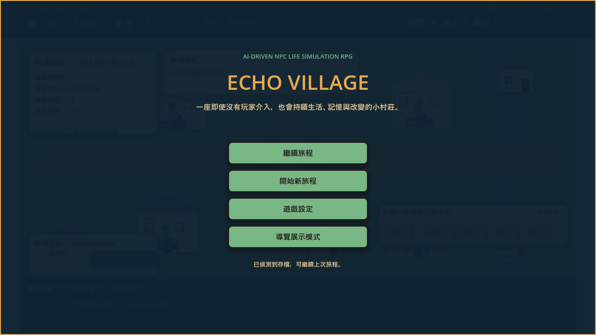
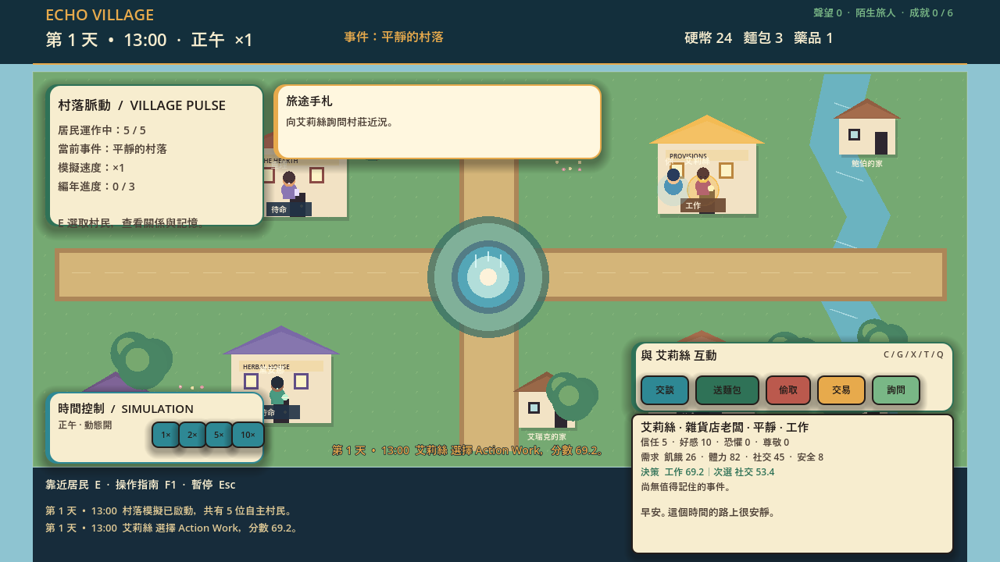
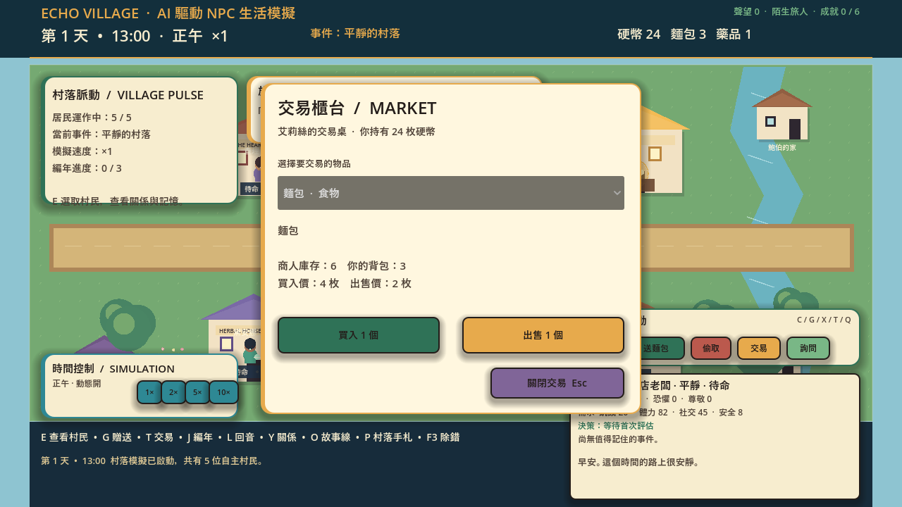
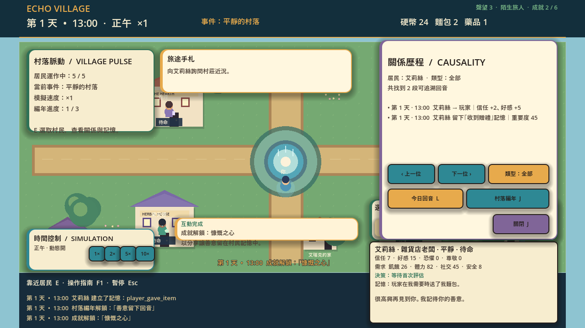

# Echo Village

Godot 4.5.2 的 Windows 2D 生活模擬遊戲。玩家探索村落、觀察居民需求與決策、建立關係、交易、完成任務，並透過可追溯的回音與故事線看見世界如何改變。

## 介面預覽

## 核心玩法

- 五名居民依需求、性格、排程與世界事件自主行動。
- Utility AI 與 state machine 產生可解釋的當前行動與決策理由。
- 對話、記憶、信任／好感、資訊傳播與可追溯事件歷程。
- 探索、地點解鎖、任務、製作、交易、村落進展與 Living Stories 分支。
- 存檔 schema、遷移、portable runtime 與壞檔降級處理。
- 資料驅動的 NPC、物品、配方、地點、任務與世界事件。

## 操作

~~~text
E 選取居民    G 贈送    T 交易    J 編年
L 回音        Y 關係    O 故事線  P 村落手札
F5 儲存       Esc 暫停
~~~

## Windows Portable

玩家可直接從 [GitHub Releases](https://github.com/Lily09-project/EchoVillage/releases/latest) 下載壓縮包，不需要安裝 Godot：

~~~powershell
.\build_release.bat
~~~

產物位於 release/EchoVillage/，建置流程會執行 PCK export、portable smoke test、錯誤文字檢查與啟動逾時清理。release/ 與 Godot engine binary 不納入 repository。

## 開發與測試

需求：Windows、Godot 4.5.2 stable。可設定 GODOT_EXECUTABLE，或使用 PATH／tools/godot 中的 runtime。

~~~powershell
.\run_echo_village.bat --test
powershell -NoProfile -ExecutionPolicy Bypass -File quality\run_acceptance.ps1 quick
powershell -NoProfile -ExecutionPolicy Bypass -File quality\run_acceptance.ps1 release
powershell -NoProfile -ExecutionPolicy Bypass -File quality\run_acceptance.ps1 nightly
~~~

品質流程包含結構與 JSON 驗證、headless Godot 測試、security audit、visual QA、Windows release smoke test，以及 90 日 nightly soak。測試結果寫入本機 tests/ 與 reports/acceptance/；不應提交產生的報告與使用者存檔。

## 系統邊界

目前公開交付是 Windows 桌面版本，GitHub repository 本身不是可直接遊玩的網站。若要提供瀏覽器網址，需要另外製作 Godot Web export，再驗證瀏覽器相容性並部署靜態檔案。

存檔位於 Godot user://，不應將真實存檔、.godot cache、release artifacts 或本機路徑提交。安全規則見 [SECURITY.md](SECURITY.md)，資料與架構見 [docs/game_design.md](docs/game_design.md)。

## 專案結構

~~~text
scenes/       場景與主遊戲畫面
scripts/      遊戲邏輯、NPC、存檔與 UI
data/         資料驅動內容
tests/        headless tests、soak 與 visual QA
tools/        bounded runner、validator、安全稽核
quality/      acceptance manifest 與報告工具
build_release.bat
~~~

目前版本：Echo Village 1.4.0｜Godot 4.5.2｜Windows 10/11 64-bit
