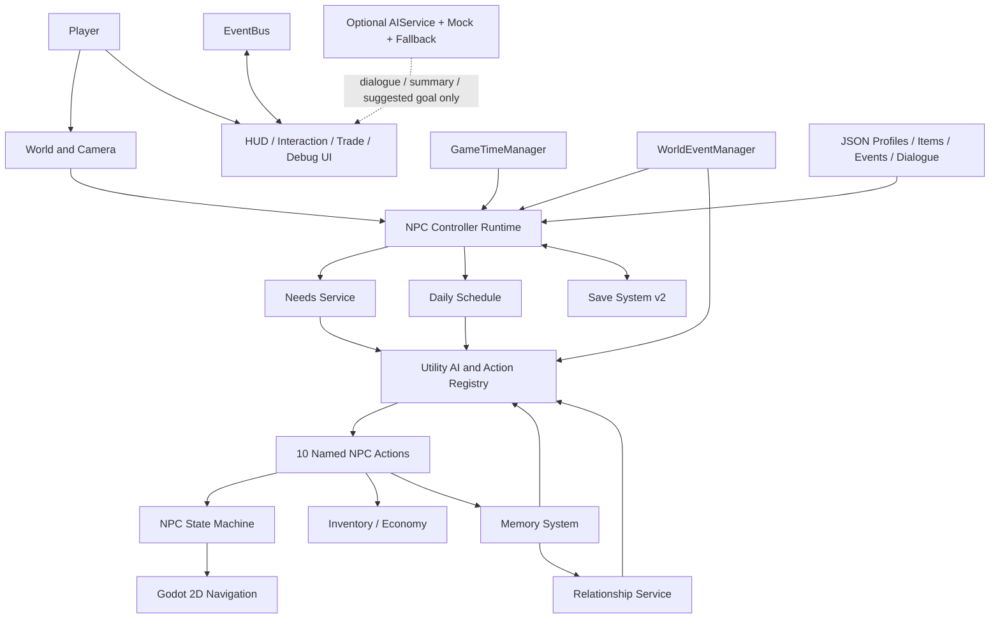

# Echo Village

> AI-Driven NPC Life Simulation RPG｜Godot 4｜繁體中文完整作品

Echo Village 是一款繪本風格的 2D NPC 生活模擬遊戲。五位居民會依照需求、個性、作息、關係、記憶與世界事件自主決策；玩家的贈禮、偷竊、交易與任務選擇會被居民記住、傳播，並寫入村落編年。

本專案的「AI」指可解釋的 Utility AI 與自主代理架構，不依賴外部生成式 AI API，離線即可完整遊玩。

## Why I Built This

一般 RPG 的居民常只是等待玩家觸發的對話點。我希望驗證另一種方向：當玩家完全不操作時，小鎮仍能由 Needs、Schedule、Personality、Memory、Relationship、World Context、Utility AI 與 State Machine 持續運作；玩家介入後，影響能被記住、傳播並改變後續選擇。

## Tech Stack

- Godot 4.5.2、GDScript、Godot 2D Navigation
- JSON 資料定義與版本化 JSON 存檔
- Windows portable runtime + PCK 發行
- Headless automated tests、GPU visual QA、PowerShell／BAT 驗證工具


## How to Run｜啟動方式

開啟 `release/EchoVillage/EchoVillage.exe`。執行檔與 `EchoVillage.pck` 必須放在同一資料夾；不需安裝 Godot，也不需設定 PATH。

若要從原始碼啟動：

```bat
run_echo_village.bat
```

一鍵測試並重建可攜版：

```bat
build_release.bat
```

> 原始碼版本需要 Godot 4.2 以上，可放入 `tools/godot/`、加入 PATH，或用 `GODOT_EXECUTABLE` 指定。此工作目錄已附本機 runtime；大型引擎執行檔不納入 Git。一般玩家請直接使用 `release/EchoVillage_1.1.0_Windows.zip`，不需安裝 Godot。

## Core Features｜核心功能

- 五位資料驅動居民，各自具備年齡、工作、住家、個性、對話人格、作息、需求與庫存。
- 十種 Utility Action：進食、睡眠、工作、社交、漫遊、購物、回家、逃跑、協助、休息。
- 獨立 NPC State Machine 管理移動、行為狀態與 90 分鐘逾時復原。
- NPC 對玩家與 NPC 對 NPC 的親密、信任、恐懼、尊重關係網。
- 結構化長期記憶、重要度衰減、容量管理與居民間記憶傳播。
- 雨天、祭典、糧食短缺、危險與林場意外等動態世界事件。
- 完整買入／賣出交易、關係折扣、事件價格、庫存與金錢原子更新。
- 背包、森林藥劑製作、任務追蹤、任務日誌、世界地圖與地點探索。
- 「林間回音」多階段任務：詢問、探索、蒐集、製作、交付與不可重複獎勵。
- 新遊戲、繼續遊戲、設定、暫停、自動存檔、手動存讀檔與舊存檔遷移。
- Godot 2D Navigation、卡住偵測、安全復原與 F3 開發診斷工具。
- 平滑 Camera2D、可關閉的程式化提示音與持久音效設定。
- Optional AIService／Mock Provider／模板 fallback；只產生文字、摘要與建議目標。
- 日夜光影、情境 HUD、十張可重複產生的 GPU 視覺 QA 畫面。


## Screenshots｜遊戲畫面

完整的十張 1280×720 GPU 擷取證據位於 [`tests/visual_qa/`](tests/visual_qa/)，涵蓋主選單、設定、交易、日夜、世界事件與任務流程。

## Controls｜操作

| 按鍵 | 功能 |
| --- | --- |
| WASD / 方向鍵 | 移動玩家 |
| E / C | 選取最近居民並交談／再次交談 |
| G / X / T / Q | 贈送麵包／偷竊／交易／詢問某人 |
| I / J / M | 背包／任務日誌／世界地圖 |
| K | 前往森林邊境或返回村落 |
| 1 / 2 / 5 / 0 | 模擬速度 1×／2×／5×／10× |
| F5 / F9 | 手動存檔／讀檔 |
| F3 | 開發診斷面板 |
| Esc | 關閉目前視窗或暫停 |

## 架構摘要



程式邏輯、內容資料、服務層、UI 與存檔遷移分離，便於增加居民、事件、任務與地點。詳見 [架構文件](docs/architecture.md)。

## NPC Decision System

每十個遊戲分鐘評估一次十種具名 Action。分數結合需求、人格、日程、事件、Mood、物品可用性、最低門檻、小幅隨機值與行動冷卻；Action Registry 選出行為後，由獨立 State Machine 與 Navigation 執行，並具有行動與移動雙層逾時復原。

## Memory System

記憶包含事件、主客體、地點、時間、描述、重要度、情緒值與 metadata。低重要度記憶每日衰減，高重要度事件保留；容量固定為每位居民 32 筆，資訊分享會建立 `heard_*` 記憶而不是直接複製權威狀態。

## Relationship System

玩家與居民、居民與居民都使用 affinity、trust、fear、respect（-100～100）。贈禮、偷竊、打招呼、爭執、救援、交易與流言會透過同一 Relationship Service 更新。

## Emergent Behavior and Demo Scenarios

- A 善意：贈送艾莉絲麵包 → 正向記憶 → 好感與信任提高 → 對話改善。
- B 流言：偷取鮑伯食物 → 負面記憶 → 分享給查理 → 查理信任下降 → 交易價格提高。
- C 危機：低勇氣居民逃離、高勇氣居民協助 → 被幫助者建立記憶 → NPC 對 NPC 信任與尊敬提高。

三個場景可從展示選單穩定重現，F3 可查看分數、目標、路徑與後果。

## Testing｜品質與測試

- 66 項 Godot 自動化測試，涵蓋七日加速模擬、存檔、經濟、任務、記憶、社交、事件、Navigation、Camera、音效、UI、可及性與 AI 架構。
- 測試啟動器會額外掃描 `SCRIPT ERROR` 與載入錯誤，避免只有斷言綠燈但 runtime 已壞。
- 10 張 1280×720 GPU 視覺 QA 截圖，涵蓋主選單、設定、交易、日夜、危險事件與完整任務。
- Windows portable 成品會再執行獨立煙霧測試。

```bat
run_echo_village.bat --test
```

最新驗證結果保存在 `tests/simulation_test_report.json`。完整測試策略見 [測試計畫](docs/test_plan.md)。

## Project Structure｜專案結構

```text
assets/       品牌與繪本視覺資料
data/         NPC、對話、事件、物品、任務、地點 JSON
scenes/       主場景與可重用 UI 場景
scripts/      Actions、AI、核心、導航、NPC、服務、存檔、UI
tests/        自動化測試、結構驗證、視覺 QA 證據
docs/         設計、架構、測試與作品集文件
release/      一鍵建置的 Windows 可攜版（不納入版本控制）
```

## Known Limitations

1. 目前是單機離線作品；AIService 已有安全介面、Mock 與 fallback，但未附帶線上 FastAPI provider。
2. 世界包含村落與森林兩個主要區域；架構已支援加入更多地點與任務鏈。
3. 美術與音效採可替換的程式化風格，尚未加入逐幀角色動畫或完整原聲帶。

## Future Roadmap

下一階段可擴充季節與天氣、居民友誼事件、更多職業經濟鏈、控制器操作與多語系。

## 作品集文件

- [作品集 Case Study](docs/portfolio_case_study.md)
- [遊戲設計](docs/game_design.md)
- [技術架構](docs/architecture.md)
- [測試計畫](docs/test_plan.md)
- [UI/UX 設計理由](docs/ui_ux_rationale.md)
- [視覺方向](docs/visual_direction.md)
- [展示腳本](docs/showcase_script.md)
- [版本紀錄](CHANGELOG.md)

版本：1.1.0｜Godot 4.5.2 runtime｜目標平台：Windows 10/11 64-bit
