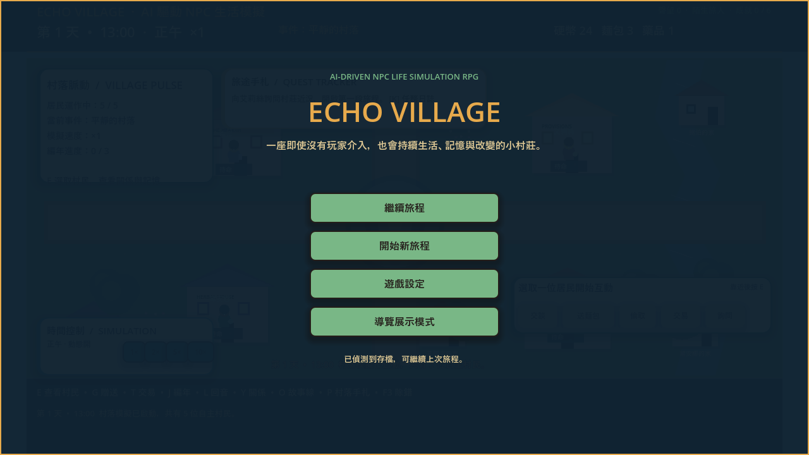
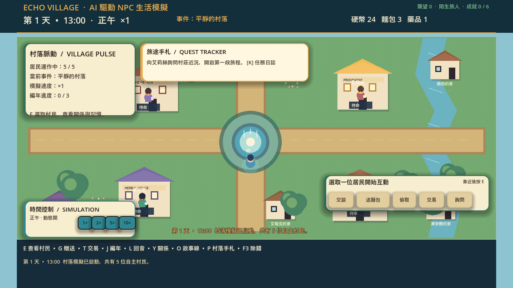
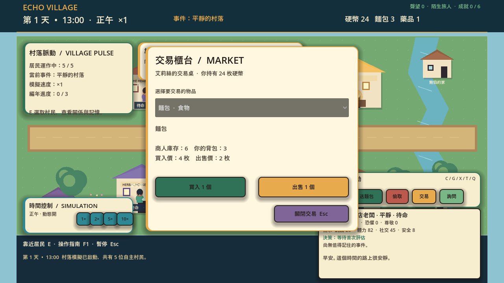
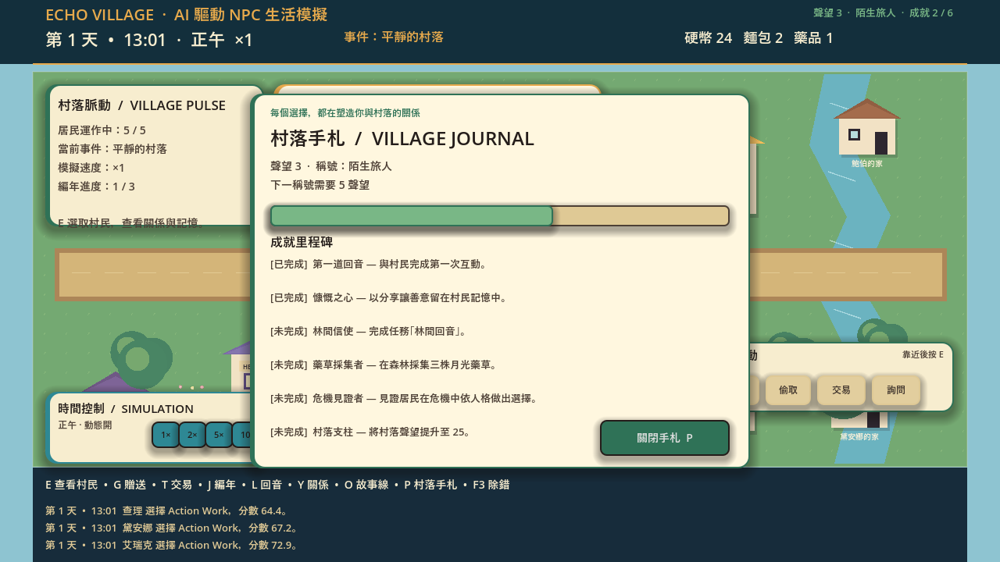
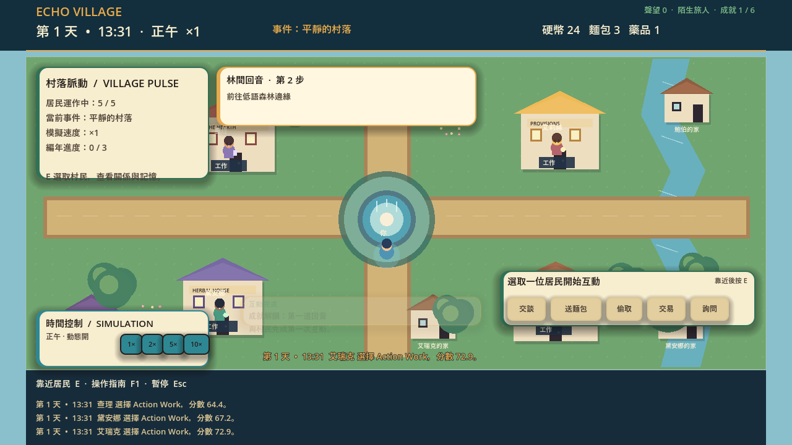
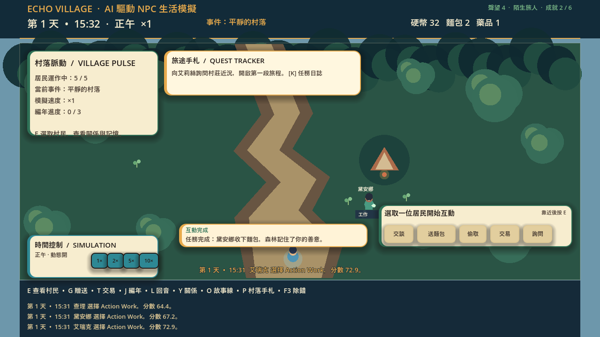
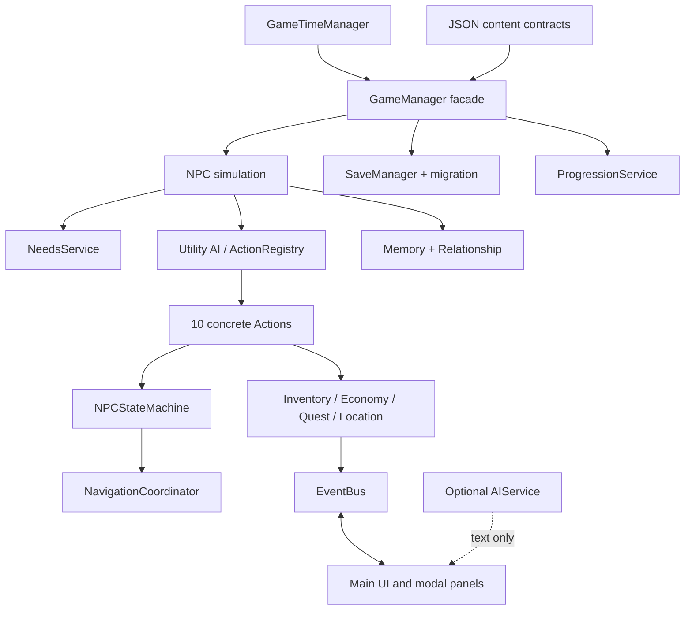

# Echo Village

> AI-Driven NPC Life Simulation RPG｜Godot 4｜繁體中文｜Windows Portable

Echo Village 是一款以「居民會記得、會判斷，也會因玩家行動改變關係」為核心的 2D 繪本風格生活模擬 RPG。玩家在村落廣場與低語森林之間探索、交談、贈禮、交易、採集與解任務；五位居民則依照需求、人格、日程、記憶、關係與世界事件自主生活。

本專案同時是一個可遊玩的獨立作品，以及一個可持續擴充的產品工程案例。它展示資料驅動內容、可解釋 Utility AI、NPC State Machine、事件與存檔相容性、繁體中文 UX、可攜式 Windows 發行，以及可重複執行的自動化品質流程。



## 一分鐘了解 Echo Village

### 玩家體驗

1. 在村落中選取居民，觀察他們目前的需求、情緒、行動與關係。
2. 透過交談、贈禮、偷取、交易、製作與採集，改變世界狀態。
3. 前往低語森林，推進多階段任務「林間回音」。
4. 回到村落手札查看聲望、成就、編年與已發生的後果。
5. 加速時間，觀察居民如何在沒有玩家直接控制的情況下繼續生活。

### 核心設計承諾

| 設計承諾 | 實際實作 |
| --- | --- |
| 每位居民都不是固定腳本 | 每 10 個遊戲分鐘重新評估需求、人格、日程、事件與行動分數 |
| 玩家選擇必須留下後果 | 記憶、關係、任務旗標、經濟、聲望與成就都會被更新並保存 |
| 失敗應該可理解、可復原 | 交易、製作與任務獎勵採驗證後一次提交，失敗不會消耗資源 |
| UI 必須真的能使用 | 主選單、設定、暫停、背包、交易、地圖、任務、手札與 Debug 工具都有實際互動流程 |
| AI 必須可解釋與可測試 | 核心決策使用離線 Utility AI；Optional AI provider 只能產生結構化文字，不能修改權威狀態 |

## 目前版本與驗收快照

| 項目 | 狀態 |
| --- | --- |
| 遊戲版本 | `1.2.0` |
| 驗證引擎 | Godot `4.5.2-stable` |
| 最低開發引擎 | Godot `4.2+` |
| 目標平台 | Windows 10/11 64-bit |
| 顯示基準 | 1280×720，使用 `canvas_items` stretch |
| 渲染路徑 | Godot Compatibility / OpenGL 相容模式 |
| 內容語言 | 繁體中文 |
| 世界狀態 schema | `v3`；存檔 envelope 為 `v2`，並提供舊版遷移 |
| 目前內容 | 5 位居民、10 種 NPC Action、2 個主要區域、1 條多階段任務鏈 |
| 自動測試 | `82 passed / 0 failed` |
| 長時間穩定性 | 30 日加速模擬通過 |
| 發行驗證 | Windows portable export 與獨立 smoke test 通過 |

## 實際遊戲畫面

以下圖片來自 `tests/visual_qa/` 的實際遊戲流程，不是設計稿或靜態 mockup。

### 探索與主介面



主畫面同時呈現遊戲時間、世界事件、居民行動、任務追蹤、模擬速度、互動列與可讀的結果回饋。

### 交易流程



交易面板會顯示商人庫存、玩家背包、買入價與出售價；交易按一次只會完成一次原子更新，資源不足時會提供明確回饋。

### 村落手札與進度



村落手札提供聲望、稱號、進度條、成就里程碑與文字化完成狀態，開啟時會可靠暫停模擬。

### 任務進行與任務完成





任務流程會跨越詢問、探索、採集、製作與交付；完成後會更新玩家物品、聲望、記憶、任務旗標與成就，而不是只切換一個 UI 標籤。

### 其他視覺 QA 證據

- [主選單](tests/visual_qa/consumer_main_menu.png)
- [設定介面](tests/visual_qa/consumer_settings.png)
- [展示模式開場](tests/visual_qa/storybook_intro.png)
- [黎明探索](tests/visual_qa/storybook_explore_dawn.png)
- [夜晚探索](tests/visual_qa/storybook_explore_night.png)
- [危險事件](tests/visual_qa/storybook_event_danger.png)

## 核心玩法與系統

### 居民自主生活

五位居民各自擁有年齡、職業、住家、人格、作息、對話傾向、起始背包與關係資料。遊戲每 10 個遊戲分鐘讓居民重新評估目前狀況，即使玩家沒有互動，村落也會持續推進。

居民的 runtime 狀態包含：

- 需求：飢餓、精力、安全、社交等 0–100 數值。
- 人格：影響需求成長、行動偏好與互動反應。
- Action / State：目前選擇的行動、Moving、Working、Sleeping 等狀態與逾時復原。
- 關係：`affinity`、`trust`、`fear`、`respect`，統一限制在 `-100` 到 `100`。
- 記憶：事件主體、客體、地點、時間、重要度、情緒與 metadata。

### Utility AI 與 State Machine

目前提供 10 種具名 Action：

`Eat`、`Sleep`、`Work`、`Socialize`、`Wander`、`Shop`、`GoHome`、`Flee`、`Help`、`Rest`

每個 Action 都遵循一致生命週期：

`can_execute → calculate_score → start → update → finish / cancel`

Action 分數會受到需求、人格、日程、Mood、世界事件、物品可用性、最低門檻與 cooldown 影響。選出行動後，由 `NPCStateMachine` 管理移動、執行與逾時；`NavigationCoordinator` 使用 Godot 2D Navigation，並提供卡住保護。

### 記憶、關係與資訊傳播

居民不會直接複製其他居民的權威狀態。當他們分享資訊時，系統會建立 `heard_*` 記憶，並依照來源、重要度與情緒影響後續行動。低重要度記憶會隨日數衰減，高重要度生命事件會受到保護；單一居民最多保留 32 筆記憶。

玩家的贈禮、偷取、協助、爭執與交談都會留下可查詢後果，並可能改變居民對玩家或彼此的信任、好感、恐懼與尊敬。

### 動態世界與任務

村落廣場與低語森林邊境會受到雨天、祭典、糧食短缺、突發危險與森林事件影響。任務「林間回音」包含：

1. 詢問居民取得線索。
2. 前往森林邊境探索。
3. 採集月光藥草等公共資源。
4. 在正確地點製作任務物品。
5. 交付給指定居民並取得一次性獎勵。

任務目標、獎勵、旗標與完成狀態都由 `QuestService` 管理，完成獎勵具備冪等性，無法重複領取。

### 經濟、製作與村落進展

- 雙向交易：根據居民、事件與物品資料計算買入／出售價格。
- 原子製作：材料、輸出物與地點都先驗證，失敗不扣除材料。
- 村落聲望：五級聲望與資料驅動成就。
- 村落手札：查看稱號、進度條、成就里程碑與編年紀錄。
- 世界事件：有起始時間、持續時間、效果、通知與跨午夜生命週期。

## 操作方式

| 按鍵 | 功能 |
| --- | --- |
| `WASD` / 方向鍵 | 移動玩家 |
| `E` | 選取最近居民或執行主要互動 |
| `C` | 與目前選取居民交談 |
| `G` / `X` | 贈送麵包／偷取食物 |
| `T` / `Q` | 開啟交易／詢問居民 |
| `I` / `J` / `M` / `K` | 背包／任務日誌／世界地圖／地點旅行 |
| `P` | 村落手札、聲望與成就 |
| `1` / `2` / `5` / `0` | 模擬速度 1×／2×／5×／10× |
| `F5` / `F9` | 手動存檔／讀檔 |
| `F3` | 開發診斷面板 |
| `Esc` | 關閉目前模態視窗或開啟暫停選單 |

開啟交易、背包、設定、任務、地圖或村落手札時，模擬會依模態規則暫停。動態效果與提示音可以在設定中關閉，偏好會持久保存。

## 快速開始

### 一般玩家：Windows Portable

1. 從 release 取得 `EchoVillage_1.2.0_Windows.zip`。
2. 解壓縮後，確認 `EchoVillage.exe` 與 `EchoVillage.pck` 位於同一個資料夾。
3. 雙擊 `EchoVillage.exe` 開始遊玩。

Portable 版本不需要安裝 Godot，也不需要設定 PATH。重新發布時，請保留同一資料夾中的 `README.txt` 與 `THIRD_PARTY_NOTICES.txt`。

### 開發者：從原始碼啟動

需求：Godot 4.2 以上；本專案以 Godot 4.5.2 stable 驗證。

```bat
run_echo_village.bat
```

啟動器會依序尋找：

1. `GODOT_EXECUTABLE` 環境變數。
2. `tools/godot/` 中的 bundled runtime。
3. PATH 中的 Godot executable。
4. 常見的 Windows 安裝位置。

自訂引擎路徑：

```powershell
$env:GODOT_EXECUTABLE = "C:\Path\To\Godot_v4.5.2-stable_win64_console.exe"
.\run_echo_village.bat
```

## 建置 Windows Portable

```bat
build_release.bat
```

建置流程會：

1. 執行結構與 JSON 驗證。
2. 執行 Godot headless parser/bootstrap preflight。
3. 執行完整 contract test 與 runtime error gate。
4. 匯出 PCK 與 Windows executable。
5. 組裝 portable 目錄並複製第三方授權 notices。
6. 啟動 packaged executable 做 smoke test。

輸出位於 `release/EchoVillage/`。`release/` 與 engine binary 不納入 Git 版本控制；這可以避免 repository 被大型發行檔與本機工具污染。

## 測試與品質保證

完整測試入口：

```bat
run_echo_village.bat --test
```

目前測試涵蓋：

- 結構與 JSON cross-reference 驗證。
- GDScript parser/bootstrap preflight。
- 五位居民與完整 runtime contract。
- Inventory、Needs、Relationship、Economy、Quest、Location 與 Progression service 邊界。
- Utility AI、10 種 Action、State Machine、Navigation 與卡住復原。
- 記憶衰減、資訊傳播、NPC 對 NPC 關係與世界事件生命週期。
- 存檔 round-trip、舊版遷移、偏好設定與安全預設值。
- 交易、製作、任務獎勵的原子性與冪等性。
- UI shell、模態互斥、交易層級、任務文案、村落手札與設定同步。
- 7 日與 30 日加速模擬的需求邊界、NPC 狀態與存檔完整性。
- `SCRIPT ERROR`、載入失敗與 launcher timeout 掃描。

測試結果會寫入 `tests/simulation_test_report.json`。目前驗收快照為 `82 passed / 0 failed`。

### Visual QA

Visual QA 截圖位於 `tests/visual_qa/`，涵蓋主選單、設定、交易、村落手札、開場、黎明、正午、夜晚、危險事件、任務進行與森林任務完成。

```bat
tools\godot\Godot_v4.5.2-stable_win64_console.exe --path . -- --visual-qa
```

檢查重點包括文字截斷、模態層級、顏色對比、按鈕可見性、狀態更新、面板遮擋、互動回饋，以及 1280×720 以外尺寸的可讀性。

## 系統架構



| 層級 | 主要責任 | 代表路徑 |
| --- | --- | --- |
| Runtime orchestration | 世界狀態、時間、事件與 facade 協調 | `scripts/core/`、`scripts/time/` |
| NPC runtime | 需求、人格、決策、行動、狀態與移動 | `scripts/ai/`、`scripts/actions/`、`scripts/npc/` |
| Domain services | 背包、需求、關係、經濟、任務、地點、進展 | `scripts/inventory/`、`scripts/needs/`、`scripts/relationship/`、`scripts/services/`、`scripts/progression/` |
| Events | 將狀態變更傳遞給 UI 與其他模組 | `scripts/core/event_bus.gd` |
| Presentation | HUD、交易、地圖、任務、手札、Debug 與繪本視覺 | `scripts/main.gd`、`scripts/ui/`、`scenes/ui/` |
| Persistence | 存檔、偏好、遷移與 portable runtime | `scripts/save/`、`run_echo_village.bat`、`build_release.bat` |

`GameManager` 是對外相容入口；服務層接收明確資料並回傳結構化結果，不直接依賴 UI 節點。更多設計決策請參考 [技術架構](docs/architecture.md)。

## 資料驅動內容

主要內容資料位於 `data/`，新增內容時不應把 ID 或規則散落硬編碼在 UI：

| 路徑 | 內容 | 驗證重點 |
| --- | --- | --- |
| `data/npcs/npc_profiles.json` | 居民 profile、人格、日程、住家與庫存 | `id` 唯一、必要欄位完整 |
| `data/dialogue/templates.json` | 對話模板與離線 fallback | 沒有 provider 也能遊玩 |
| `data/events/world_events.json` | 世界事件生命週期與效果 | 時間、持續時間、效果與通知完整 |
| `data/world/locations.json` | 地點、鄰接、解鎖需求與地標 | 鄰接 ID 存在且唯一 |
| `data/quests/quests.json` | 任務條件、目標順序、獎勵與旗標 | cross-reference 通過驗證 |
| `data/items/items.json` | 物品名稱、分類與基礎定義 | 物品 ID 與交易／配方一致 |
| `data/items/recipes.json` | 素材、輸出與所需地點 | 素材、輸出物與地點存在 |
| `data/progression/achievements.json` | 聲望與成就條件 | 未知條件安全失敗 |

新增資料後，先執行：

```powershell
powershell -NoProfile -ExecutionPolicy Bypass -File tools\validate_project.ps1
```

再執行完整 Godot 測試，確認資料契約、cross-reference 與 runtime 行為都通過。

## 存檔、安全與 Optional AI

### 存檔相容性

目前世界狀態 schema 為 `v3`，包含玩家與 NPC runtime、背包、關係、記憶、世界事件、事件紀錄、地點探索、任務、世界旗標、村落進展與遊戲時間。舊版存檔會先經過遷移與預設值補全，再驗證資料格式，最後才套用到目前世界；載入失敗不會覆蓋有效狀態。

### 安全邊界

- 真實 `.env`、API key、token、password、使用者存檔與本機 cache 不提交至 repository。
- Optional AI provider 只透過環境變數設定，參考 `.env.example`。
- AIService 只輸出結構化文字、記憶摘要與建議目標，不能直接修改 GameManager 的權威狀態。
- Client-facing UI 不承擔權限或資料驗證責任；交易、製作、任務與存檔都在 domain/service 層重新驗證。

## 專案結構

```text
EchoVillage/
├─ assets/                  # 封面、品牌與繪本視覺資產
├─ data/                    # NPC、對話、事件、物品、任務、地點、成就 JSON
├─ scenes/                  # 主場景與可重用 UI 場景
├─ scripts/                 # Actions、AI、核心、NPC、服務、存檔與 UI
├─ tests/                   # headless runner、報告與 visual QA
├─ tools/                   # 結構驗證與 Godot runtime 輔助工具
├─ docs/                    # 架構、設計、測試與作品集文件
├─ project.godot            # Godot 設定與 Autoload
├─ run_echo_village.bat     # 啟動與測試入口
└─ build_release.bat        # Windows portable 發行建置
```

## 開發規範

1. 先判斷功能屬於資料、domain service、runtime 或 presentation 哪一層。
2. 先定義資料契約與失敗條件，再實作 happy path。
3. 跨模組狀態變更透過服務與 EventBus 傳遞，不從 UI 直接修改其他模組的內部資料。
4. 為正常、空資料、非法輸入、失敗與成功流程加入 contract test。
5. UI 操作必須有成功、失敗、禁用或 Loading feedback，並保持鍵盤可達性與足夠點擊尺寸。
6. 新增資料後先跑 validator，再跑 headless tests 與必要的 visual QA。
7. 不提交 `.env`、API key、token、password、使用者存檔、本機 cache 或大型 engine binary。

## 故障排除

### 找不到 Godot

請安裝 Godot 4.2+，或將 console executable 放入 `tools/godot/`、加入 PATH，或設定 `GODOT_EXECUTABLE`。一般玩家應使用 portable release，不需要 Godot。

### 測試啟動但沒有結果

請使用：

```bat
run_echo_village.bat --test
```

不要直接雙擊 GUI Godot 來判斷測試是否通過。測試入口會檢查結構、parser、退出碼與 runtime error；若使用自訂 engine，請確認 `GODOT_EXECUTABLE` 指向 console build。

### 存檔位置

存檔與偏好位於 Godot 使用者資料目錄 `user://`。請勿將真實使用者存檔提交至 repository。

## Roadmap

目前作品已完成可遊玩的村落與森林垂直切片；下一階段可沿著既有服務邊界擴充：

- 季節循環、天氣與地圖事件鏈。
- 居民友誼、衝突與家庭事件。
- 職業供應鏈、商店經濟與村落建設。
- 更多可探索地圖、任務分支與長期聲望目標。
- 控制器支援、更多語系與觸控友善 UI。
- 正式 AI provider adapter，但維持權威狀態隔離與離線 fallback。

## 文件索引

- [技術架構](docs/architecture.md)
- [遊戲設計](docs/game_design.md)
- [NPC 系統](docs/npc_system.md)
- [記憶系統](docs/memory_system.md)
- [測試計畫](docs/test_plan.md)
- [UI/UX 設計理由](docs/ui_ux_rationale.md)
- [視覺方向](docs/visual_direction.md)
- [作品集 Case Study](docs/portfolio_case_study.md)
- [展示腳本](docs/showcase_script.md)
- [版本紀錄](CHANGELOG.md)
- [第三方授權](THIRD_PARTY_NOTICES.txt)

## License and third-party notices

第三方元件與授權資訊請參考 [THIRD_PARTY_NOTICES.txt](THIRD_PARTY_NOTICES.txt)。重新發布 Windows portable 成品時，請一併保留該檔案。

---

Echo Village 1.2.0｜Godot 4.5.2 runtime｜Windows 10/11 64-bit
