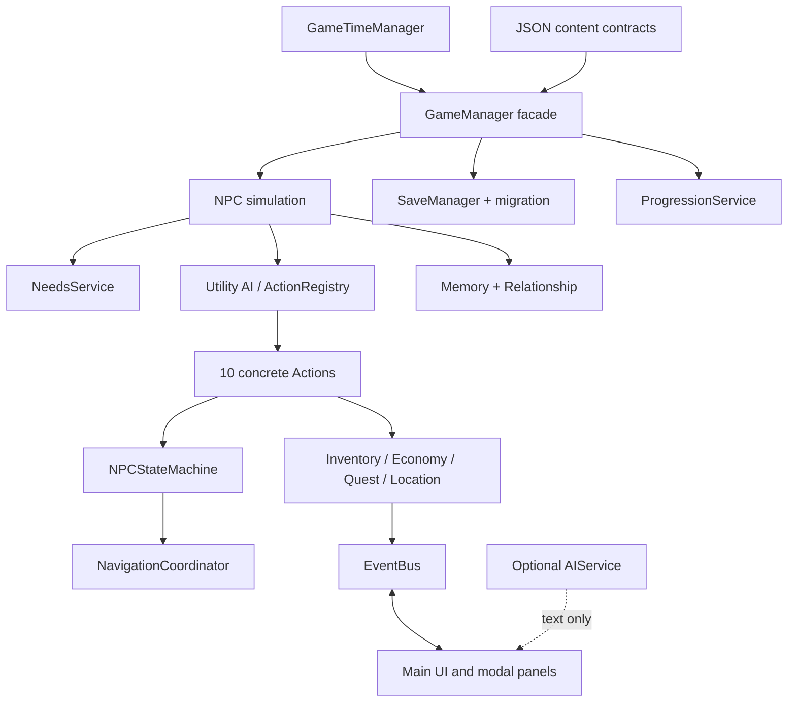

# Echo Village

> AI-Driven NPC Life Simulation RPG｜Godot 4｜繁體中文｜Windows Portable

Echo Village 是一款繪本風格 2D NPC 生活模擬 RPG。村落中的居民會依照需求、人格、日程、關係、記憶與世界事件自主生活；玩家的贈禮、偷竊、交易與任務選擇會留下可追蹤的後果，並逐步改變居民對彼此與村落的理解。

本專案的「AI」採用可解釋、可測試、可離線執行的 Utility AI 與 NPC Agent 架構，不依賴外部生成式 AI API 才能遊玩。Optional `AIService` 只負責結構化文字、記憶摘要與建議目標，不能直接修改權威遊戲狀態；沒有 provider 時會安全回退到模板內容。


## 專案定位

Echo Village 同時是一個可遊玩的獨立作品與一個可持續擴充的產品工程案例，展示：

- 資料驅動的 NPC、事件、任務、地點、物品與成就系統。
- 需求、人格、日程、Utility AI、Action Registry、State Machine 與 Navigation 組成的自主代理流程。
- 可觀察的記憶、關係、交易、任務與聲望後果，而非只播放固定劇情。
- EventBus、服務邊界、版本化存檔與遷移機制支撐後續內容擴充。
- 中文化消費者介面、模態視窗、設定、暫停、存檔、交易、任務與開發診斷工具。
- Headless automation、結構驗證、runtime error gate 與 GPU visual QA 的品質流程。

## 目前版本

| 項目 | 內容 |
| --- | --- |
| 遊戲版本 | `1.2.0` |
| 測試引擎 | Godot `4.5.2-stable` |
| 最低開發引擎 | Godot `4.2` 以上 |
| 目標平台 | Windows 10/11 64-bit |
| 顯示基準 | 1280×720，支援 `canvas_items` 縮放 |
| 渲染器 | Godot Compatibility / OpenGL 相容路徑 |
| 語言 | 繁體中文 |
| 存檔格式 | World State v3，含舊版安全遷移 |
| 內容規模 | 5 位居民、10 種 NPC Action、2 個主要區域、1 條多階段任務鏈 |

## 快速開始

### 一般玩家：Windows Portable

1. 解壓 `release/EchoVillage_1.2.0_Windows.zip`。
2. 確認 `EchoVillage.exe` 與 `EchoVillage.pck` 位於同一資料夾。
3. 雙擊 `EchoVillage.exe`。

不需要安裝 Godot，也不需要設定 PATH。重新發布 portable 成品時，請保留同資料夾中的 `README.txt` 與 `THIRD_PARTY_NOTICES.txt`。

### 開發者：從原始碼啟動

需要 Godot 4.2 以上；本專案以 Godot 4.5.2 stable 進行驗證。

```bat
run_echo_village.bat
```

啟動器會依序尋找環境變數 `GODOT_EXECUTABLE`、`tools/godot/` 中的 bundled runtime、PATH 中的 Godot，以及常見 Windows 安裝位置。自訂引擎路徑範例：

```powershell
$env:GODOT_EXECUTABLE = "C:\Path\To\Godot_v4.5.2-stable_win64_console.exe"
.\run_echo_village.bat
```

### 建置發行版

```bat
build_release.bat
```

建置流程會先執行測試，再匯出 PCK、組裝 portable runtime、複製第三方授權 notices，最後 smoke-test packaged executable。輸出位於 `release/EchoVillage/`；`release/` 不納入 Git 版本控制。

## 核心玩法

### 居民自主生活

五位居民各自擁有年齡、職業、住家、人格、作息、對話傾向、起始背包與關係資料。即使玩家暫停互動，模擬仍會依遊戲時間推進需求、情緒、行動與位置。

### Utility AI 與 State Machine

每 10 個遊戲分鐘，居民會評估 10 種具名 Action：

`Eat`、`Sleep`、`Work`、`Socialize`、`Wander`、`Shop`、`GoHome`、`Flee`、`Help`、`Rest`

分數會受到需求、人格、日程、Mood、世界事件、物品可用性、最低門檻與 cooldown 影響。Action Registry 選出行動後，NPC State Machine 管理移動、工作、睡眠、社交與逾時復原；NavigationCoordinator 負責 Godot 2D Navigation 路徑與卡住保護。

### 記憶與關係後果

記憶包含事件類型、主體、客體、地點、時間、描述、重要度、情緒值與 metadata。低重要度記憶會隨日數衰減，高重要度記憶會受到保護；每位居民最多保留 32 筆記憶。居民分享資訊時會建立 `heard_*` 記憶，不會直接複製另一位居民的權威狀態。

關係使用四個可追蹤維度，並統一限制在 `-100` 到 `100`：

- `affinity`：好感與親近程度。
- `trust`：信任與可靠度。
- `fear`：恐懼與威脅感知。
- `respect`：尊敬與行動影響力。

### 動態世界與任務

村落廣場與低語森林邊境會受到雨天、祭典、糧食短缺、突發危險與林場意外影響。「林間回音」任務鏈包含詢問、探索、採集、製作、交付與一次性獎勵。交易、製作、任務交付與獎勵均採先驗證、後一次提交的原子流程；失敗不會消耗玩家資源。

### 村落進展

玩家選擇會累積村落聲望，並透過「村落手札」查看稱號、成就與文字化里程碑。目前包含五級聲望與六項資料驅動成就，成就解鎖具冪等性並會寫入存檔。


## 操作方式

| 按鍵 | 功能 |
| --- | --- |
| `WASD` / 方向鍵 | 移動玩家 |
| `E` | 選取最近居民，或執行主要互動 |
| `C` | 與目前選取居民交談 |
| `G` / `X` | 贈送麵包／偷取食物 |
| `T` / `Q` | 開啟交易／詢問居民 |
| `I` / `J` / `M` / `K` | 背包／任務日誌／世界地圖／地點旅行 |
| `P` | 村落手札、聲望與成就 |
| `1` / `2` / `5` / `0` | 模擬速度 1×／2×／5×／10× |
| `F5` / `F9` | 手動存檔／讀檔 |
| `F3` | 開發診斷面板 |
| `Esc` | 關閉模態視窗或暫停遊戲 |

開啟交易、背包、設定、任務、地圖或村落手札時，模擬會依模態規則暫停。動態視覺效果與提示音可在設定中關閉。

## 系統架構



| 層級 | 主要責任 | 代表路徑 |
| --- | --- | --- |
| Runtime orchestration | 世界狀態、時間、事件與 facade 協調 | `scripts/core/`、`scripts/time/` |
| NPC runtime | 需求、人格、決策、行動、狀態與移動 | `scripts/ai/`、`scripts/actions/`、`scripts/npc/` |
| Domain services | 背包、需求、關係、經濟、任務、地點、進展 | `scripts/inventory/`、`scripts/needs/`、`scripts/relationship/`、`scripts/services/`、`scripts/progression/` |
| Events | 將狀態變更傳遞給 UI 與其他模組 | `scripts/core/event_bus.gd` |
| Presentation | HUD、交易、地圖、任務、手札、Debug 與繪本視覺 | `scripts/main.gd`、`scripts/ui/`、`scenes/ui/` |
| Persistence | 存檔、偏好、遷移與 portable runtime | `scripts/save/`、`run_echo_village.bat`、`build_release.bat` |

`GameManager` 是對外相容入口；服務層接收明確資料並回傳結構化結果，不直接依賴 UI 節點。完整說明請參考 [技術架構](docs/architecture.md)。

## 資料驅動內容

主要內容資料位於 `data/`：

| 路徑 | 內容 | 基本契約 |
| --- | --- | --- |
| `data/npcs/npc_profiles.json` | 居民 profile、人格、日程、住家與庫存 | `id` 唯一，必要欄位完整 |
| `data/dialogue/templates.json` | 對話模板與 fallback | 保持離線可用 |
| `data/events/world_events.json` | 世界事件生命週期與效果 | 起始時間、持續時間、效果與通知 |
| `data/world/locations.json` | 地點、鄰接、解鎖需求與地標 | 鄰接 ID 存在且唯一 |
| `data/quests/quests.json` | 任務條件、目標順序、獎勵與旗標 | 目標引用通過 cross-reference 驗證 |
| `data/items/items.json` | 物品名稱、分類與基礎定義 | 使用資料中的 item ID |
| `data/items/recipes.json` | 素材、輸出與所需地點 | 素材、輸出物與地點都存在 |
| `data/progression/achievements.json` | 聲望與成就條件 | 未知條件安全失敗 |

新增資料後，先執行 `tools/validate_project.ps1`，再執行 Godot 測試；不要將內容 ID 或規則硬編碼在 UI。

## 存檔與相容性

目前使用 `save_version: 3`，包含玩家與 NPC runtime、背包、關係、記憶、世界事件、事件紀錄、地點探索、任務、世界旗標、進展與遊戲時間。舊版存檔會先經過遷移與預設值補全，再驗證資料格式，最後才套用到目前世界；載入失敗不會覆蓋有效狀態。

## 測試與品質保證

主要測試入口：

```bat
run_echo_village.bat --test
```

流程包含結構與 JSON 驗證、cache-clean parser/bootstrap preflight、Godot headless contract tests、七日加速模擬、存檔 round-trip、舊版遷移、交易／任務／進展／Navigation／Camera／UI 測試，以及 `SCRIPT ERROR` 與載入錯誤掃描。

測試報告輸出至 `tests/simulation_test_report.json`。新增功能時應加入可驗證的 contract test，而不是只靠手動點擊。

### Visual QA

```bat
tools\godot\Godot_v4.5.2-stable_win64_console.exe --path . -- --visual-qa
```

輸出位於 `tests/visual_qa/`，涵蓋主選單、設定、交易、村落手札、開場、黎明、正午、夜晚、危險事件、任務進行與森林任務完成。檢查文字截斷、模態層級、對比、按鈕可見性、狀態更新、面板遮擋與不同視窗尺寸下的可讀性。

## 專案結構

```text
EchoVillage/
├─ assets/                  # 封面、品牌與繪本視覺資產
├─ data/                    # NPC、對話、事件、物品、任務、地點、成就 JSON
├─ scenes/                  # 主場景與可重用 UI 場景
├─ scripts/                 # Actions、AI、核心、NPC、服務、存檔與 UI
├─ tests/                   # headless runner、報告與 visual QA
├─ tools/                   # 結構驗證與 Godot runtime 輔助工具
├─ docs/                    # 架構、設計、測試與作品集文件
├─ project.godot            # Godot 設定與 Autoload
├─ run_echo_village.bat     # 啟動與測試入口
└─ build_release.bat        # Windows portable 發行建置
```

## 開發規範

1. 先判斷功能屬於資料、domain service、runtime 或 presentation 哪一層。
2. 先定義資料契約與失敗條件，再實作 happy path。
3. 跨模組狀態變更透過服務與 EventBus 傳遞，不從 UI 直接修改其他模組的內部資料。
4. 為正常、空資料、非法輸入、失敗與成功流程加入測試。
5. UI 操作必須有成功、失敗、禁用或 Loading feedback，並保持鍵盤可達性與足夠點擊尺寸。
6. 不提交 `.env`、API key、token、password、使用者存檔、本機 cache 或大型 engine binary。
7. Optional AI provider 只能透過環境變數設定；請參考 `.env.example`，不要把真實密鑰寫入 repository。

## 故障排除

### 找不到 Godot

請安裝 Godot 4.2+，或將 console executable 放入 `tools/godot/`、加入 PATH，或設定 `GODOT_EXECUTABLE`。一般玩家應使用 portable release，不需要 Godot。

### 測試啟動但沒有結果

請使用 `run_echo_village.bat --test`，不要直接雙擊 GUI Godot 來判斷測試是否通過。測試入口會檢查結構、parser、退出碼與 runtime error；若使用自訂 engine，請確認 `GODOT_EXECUTABLE` 指向 console build。

### 存檔位置

存檔與偏好位於 Godot 的使用者資料目錄 `user://`。請勿將真實使用者存檔提交至 repository。

## 已知限制與 Roadmap

目前是單機離線作品，主要內容集中於村落廣場與低語森林邊境；美術與音效採可替換的程式化繪本風格，尚未加入逐幀角色動畫或完整原聲帶。後續可沿著既有服務邊界擴充季節循環、居民友誼事件、職業供應鏈、更多地圖與任務、控制器支援、多語系，以及隔離權威狀態的正式 AI provider。

## 文件索引

- [技術架構](docs/architecture.md)
- [遊戲設計](docs/game_design.md)
- [NPC 系統](docs/npc_system.md)
- [記憶系統](docs/memory_system.md)
- [測試計畫](docs/test_plan.md)
- [UI/UX 設計理由](docs/ui_ux_rationale.md)
- [視覺方向](docs/visual_direction.md)
- [作品集 Case Study](docs/portfolio_case_study.md)
- [展示腳本](docs/showcase_script.md)
- [版本紀錄](CHANGELOG.md)
- [第三方授權](THIRD_PARTY_NOTICES.txt)

## License and third-party notices

第三方元件與授權資訊請參考 [THIRD_PARTY_NOTICES.txt](THIRD_PARTY_NOTICES.txt)。重新發布 Windows portable 成品時，請一併保留該檔案。

---

Echo Village 1.2.0｜Godot 4.5.2 runtime｜Windows 10/11 64-bit
