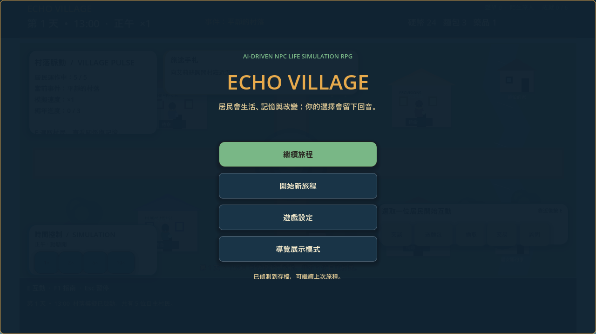
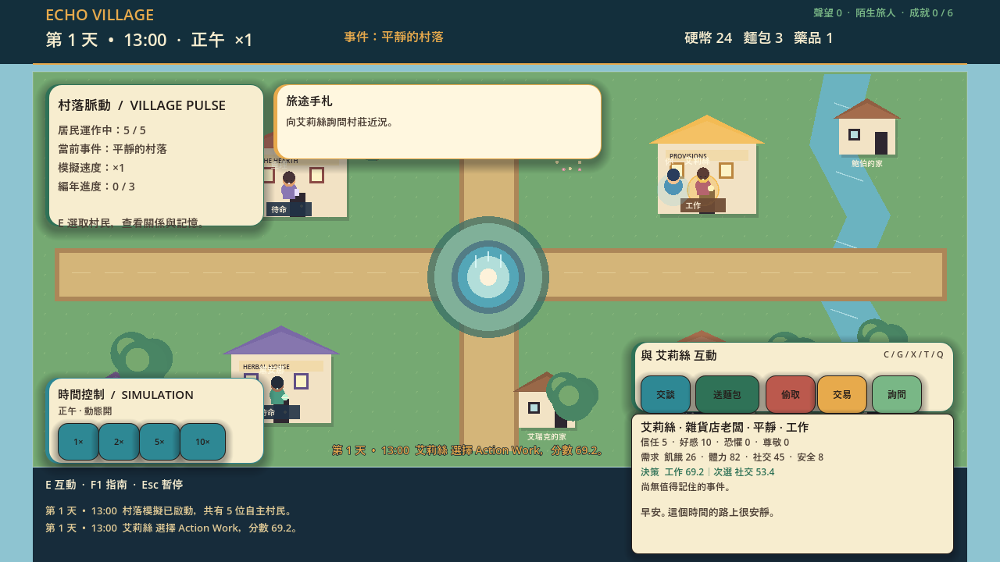
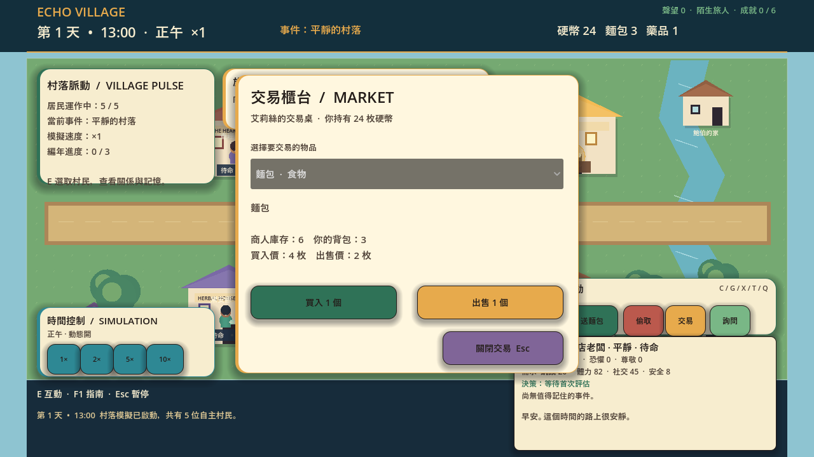
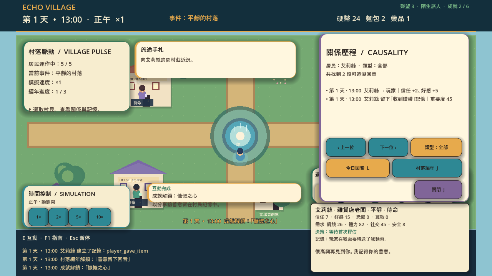

# Echo Village

Godot 4.5.2 的 Windows 2D 生活模擬遊戲。玩家探索村落、觀察居民決策、建立關係、交易與完成任務；世界狀態會透過可追溯的回音與故事線持續改變。

## 介面預覽






## Highlights

- Utility AI 與 state machine，呈現居民目前行動與決策理由。
- 需求、性格、排程、關係、記憶與資訊傳播共同驅動世界狀態。
- 探索、任務、製作、交易、地點解鎖與 Living Stories 分支。
- 存檔 schema、遷移、portable runtime 與壞檔降級處理。

## Controls

```text
E 選取居民   G 贈送   T 交易   J 編年   L 回音
Y 關係       O 故事線 P 村落手札 F5 儲存   Esc 暫停
```

## Run & test

需求：Windows、Godot 4.5.2 stable。可設定 `GODOT_EXECUTABLE`，或使用 PATH／`tools/godot` 中的 runtime。

```powershell
.\run_echo_village.bat --test
powershell -NoProfile -ExecutionPolicy Bypass -File quality\run_acceptance.ps1 quick
powershell -NoProfile -ExecutionPolicy Bypass -File quality\run_acceptance.ps1 release
```

Windows portable release：

```powershell
.\build_release.bat
```

產物位於 `release/EchoVillage/`，不提交 Godot engine、`.godot` cache、release artifacts 或使用者存檔。也可從 [GitHub Releases](https://github.com/Lily09-project/EchoVillage/releases/latest) 下載。

## Scope & security

目前公開交付是 Windows 桌面版本；若要提供瀏覽器網址，需另外製作並驗證 Godot Web export。安全規則見 [SECURITY.md](SECURITY.md)，遊戲設計見 [docs/game_design.md](docs/game_design.md)。

目前版本：Echo Village 1.4.0｜Godot 4.5.2｜Windows 10/11 64-bit
